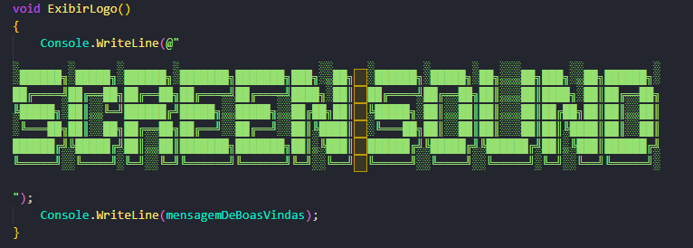

# Screen Sound

<p>Projeto realizado durante a Formação C# com Programação Orientada a Objetos da Alura. Com a proposta de criar uma aplicação Back-end com C#, para gerenciar um sistema de músicas.</p>



## Para a realização desse projeto ele foi dividido em 4 partes:

### - Parte 1 - Criando a aplicação

- Criando um programa em C# e entenda o conceito de tipagem forte
- Explorando o ecossistema do C#, incluindo a documentação e recursos úteis, como Stackoverflow e Office 2019
- Criando as funções para mostrar o menu principal e registrar bandas em listas e dicionários
- Avaliar bandas e calcular médias com base nos dados registrados

### - Parte 2 - Aplicando a Orientação a Objetos

- Criando e manipulando classes e objetos em C#
- Utilizando propriedades e métodos para gerenciar atributos
- Desenvolvendo habilidades em programação orientada a objetos
- Trabalhando com listas e lambdas em C#
- Gerenciando relacionamentos entre classes no Visual Studio
- Aplicando construtores e parâmetros em C#

### - Parte 3 - Dominando a Orientação a Objetos

- Entendendo a importância da Orientação a Objetos
- Implementando herança e interfaces
- Utilizando métodos estáticos e encapsulamento
- Dominando o conceito de polimorfismo
- Sobrescrevendo métodos para criar comportamentos específicos

```

░██████╗░█████╗░██████╗░███████╗███████╗███╗░░██╗  ░██████╗░█████╗░██╗░░░██╗███╗░░██╗██████╗░
██╔════╝██╔══██╗██╔══██╗██╔════╝██╔════╝████╗░██║  ██╔════╝██╔══██╗██║░░░██║████╗░██║██╔══██╗
╚█████╗░██║░░╚═╝██████╔╝█████╗░░█████╗░░██╔██╗██║  ╚█████╗░██║░░██║██║░░░██║██╔██╗██║██║░░██║
░╚═══██╗██║░░██╗██╔══██╗██╔══╝░░██╔══╝░░██║╚████║  ░╚═══██╗██║░░██║██║░░░██║██║╚████║██║░░██║
██████╔╝╚█████╔╝██║░░██║███████╗███████╗██║░╚███║  ██████╔╝╚█████╔╝╚██████╔╝██║░╚███║██████╔╝
╚═════╝░░╚════╝░╚═╝░░╚═╝╚══════╝╚══════╝╚═╝░░╚══╝  ╚═════╝░░╚════╝░░╚═════╝░╚═╝░░╚══╝╚═════╝░


Boas vindas ao Screen Sound

Digite 1 para registrar uma banda
Digite 2 para registrar o álbum de uma banda
Digite 3 para mostrar todas as bandas
Digite 4 para avaliar uma banda
Digite 5 para avaliar um album
Digite 6 para exibir os detalhes de uma banda
```

### - Parte 4 - Consumindo API, gravando arquivos e utilizando o LINQ

- Como integrar seus projetos com aplicações externas
- Transformar um JSON de uma API externa em objetos C#
- Manipular os dados com LINQ
- Como criar arquivos JSON ou TXT com C# de forma prática
- Manipulando os campos de uma API atribuindo a uma propriedade

```json
{
  {
    "nome": "Jean",
    "musicas": [
        {
            "song": "#thatPOWER",
            "artist": "will.i.am",
            "duration_ms": 279506,
            "genre": "hip hop, pop"
        },
        {
            "song": "\u0027Till I Collapse",
            "artist": "Eminem",
            "duration_ms": 297786,
            "genre": "hip hop"
        },
        {
            "song": "(When You Gonna) Give It Up to Me (feat. Keyshia Cole) - Radio Version",
            "artist": "Sean Paul",
            "duration_ms": 243880,
            "genre": "hip hop, pop"
        },
        {
            "song": "...Ready For It?",
            "artist": "Taylor Swift",
            "duration_ms": 208186,
            "genre": "pop"
        },
        {
            "song": "03\u0027 Bonnie \u0026 Clyde",
            "artist": "JAY-Z",
            "duration_ms": 205560,
            "genre": "hip hop"
        }]
    }
}
```

## Tecnologias utilizadas no projeto

- .NET
- C#

<hr>
</br>

[](https://www.linkedin.com/in/jeancarlotorre619b/)

<h3>Contribuindo</h3>

⭐️ Star o projeto

🐛 Encontrar e relatar issues
